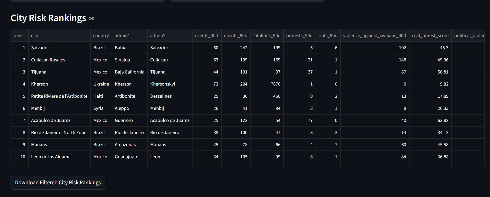
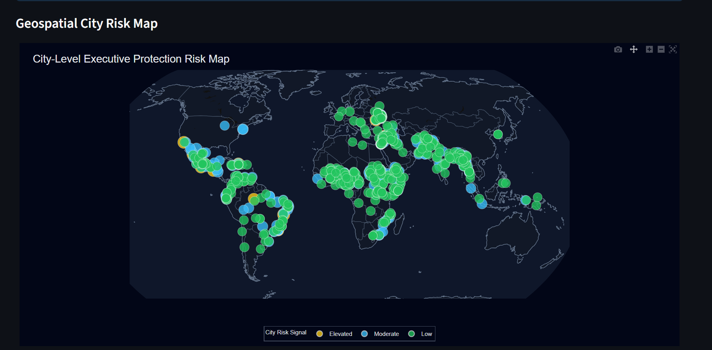
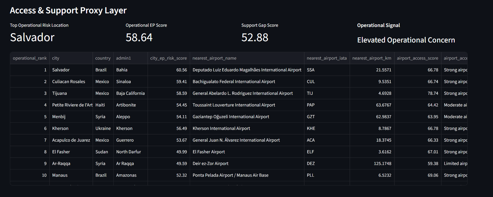
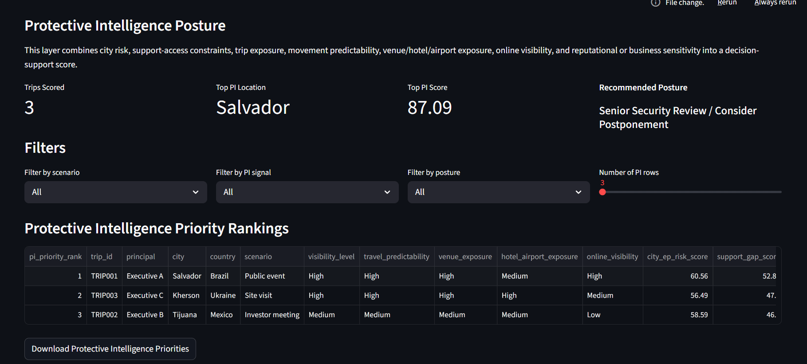

# Executive Protection Risk Intelligence Model

## A Quantitative OSINT Model for Executive Protection Risk in Global Energy Operations

This project builds a data-driven, open-source intelligence (OSINT) model for estimating executive protection risk in global energy operations. The model combines country-level operating-environment risk scoring, city/location-level ACLED event analysis, geospatial risk visualization, airport access proxies, medical capacity proxies, protective intelligence exposure scoring, scenario analysis, Monte Carlo robustness testing, regional spillover analysis, and executive-facing intelligence signal scoring.

The project is designed to support strategic thinking around executive travel, site visits, corporate events, public appearances, high-visibility leadership movement, and operating-environment risk in countries and cities where energy-sector exposure intersects with civil unrest, political violence, governance weakness, violent-crime exposure, regional instability, support-access constraints, principal exposure, movement predictability, online visibility, and recent risk momentum.

The project is intended for portfolio, research, and strategic risk-intelligence purposes. It does **not** represent any company’s internal executive protection methodology, proprietary risk process, or operational security planning.

---

## Project Objective

Executive protection is often discussed through a tactical lens, and many practitioners emphasize the importance of advance work. This project focuses on the strategic intelligence side of that process by using public data to support operating-environment analysis and quantitative risk screening.

This project asks:

> Can public OSINT datasets and structured trip-exposure assumptions be combined into a quantitative model that identifies countries, cities, planned movements, and operating environments where executive protection planning may require elevated attention for global energy operations?

The model combines public data on:

- Political violence
- Civil unrest and protest activity
- Violence against civilians
- Fatality trends
- Geographic spread of instability
- Governance and rule-of-law conditions
- Violent-crime proxy indicators
- Energy-sector exposure
- Recent event momentum
- Regional spillover exposure
- Scenario-specific executive protection contexts
- Monte Carlo model robustness
- Run-to-run change detection
- Forward-looking ACLED nowcast signals where available
- City/location-level ACLED event patterns
- Airport access and support-environment constraints
- Country-level medical capacity proxies
- Principal / executive exposure assumptions
- Movement predictability and venue exposure assumptions
- Online / information leakage indicators
- Protective intelligence posture recommendations
- Executive-facing intelligence signal scoring

The result is a country-level **Executive Protection Risk Score**, city-level **City EP Risk Score**, access-adjusted **Operational EP Risk Score**, trip-level **Protective Intelligence Risk Score**, protective posture recommendation layer, scenario-adjusted risk framework, sensitivity analysis, Monte Carlo robustness layer, regional spillover model, intelligence signal layer, diagnostics framework, Streamlit dashboard, country intelligence profiles, geospatial city risk map, and PDF report suitable for portfolio presentation.

---

## Why This Project Matters

For multinational energy companies, executive protection extends beyond the protective detail itself. It can also involve:

- Executive travel risk assessments
- Site-visit planning
- Public event security planning
- Route and movement risk evaluation
- Civil unrest monitoring
- Energy infrastructure exposure awareness
- High-visibility executive movement
- Labor unrest and protest-environment screening
- Coordination with local security and operating teams
- Geopolitical and public-sentiment risk awareness
- Regional instability monitoring
- Data-driven protective intelligence triage
- City/location-level event monitoring
- Airport access and support-environment awareness
- Medical-capacity proxy review for planning context
- Principal exposure and itinerary predictability screening
- Venue, hotel, airport, and public-space exposure review
- Online visibility and information-leakage awareness
- Protective posture decision-support

This project translates those strategic concerns into a structured, quantitative risk-intelligence model using public data.

---

## Project Highlights

The final project includes:

- A fully automated Python pipeline
- ACLED political violence and civil unrest processing
- World Bank governance, macro, energy, homicide, and health indicator collection
- Country-level Executive Protection Risk Score
- Bounded severity calibration layer
- Scenario analysis for executive protection contexts
- Sensitivity analysis across alternative weighting assumptions
- Monte Carlo simulation with 1,000 randomized model-weight runs
- Regional spillover risk overlay
- 2026 forward-risk nowcast framework with missing-data guardrails
- Executive Protection Intelligence Signal layer
- Run-to-run change detection
- Country intelligence profile generation
- City/location-level ACLED protective intelligence ranking layer
- 30/60/90/180-day city event monitoring features
- City risk component scoring for civil unrest, political violence, severity, momentum, and EP-relevant exposure
- Interactive geospatial city risk map using Plotly
- Airport access proxy using OurAirports reference data
- Medical capacity proxy using World Bank health indicators
- Support access and support gap scoring
- Access-adjusted operational EP risk score
- Protective Intelligence Exposure and Decision-Support Layer
- Trip/principal exposure scoring from a structured planning CSV
- Protective Intelligence Risk Score
- Protective posture recommendations
- Analyst priority notes for planned movements
- Model governance and methodology documentation
- Model diagnostics and data coverage checks
- Streamlit dashboard
- Final PDF report

---

## Dashboard Preview

The screenshots below are included for GitHub portfolio presentation and should be stored in:

```text
outputs/screenshots/
```

### City-Level Protective Intelligence Rankings



### Geospatial City Risk Map



### Access and Support Proxy Layer



### Protective Intelligence Posture



---

## Project Structure

```text
executive-protection-risk-intelligence-model/
|
|-- app.py
|
|-- data/
|   |-- raw/
|   |   |-- acled_events.csv
|   |   |-- acled_events_checkpoint.csv
|   |   |-- acled_2025_2026_forward_events.csv
|   |   |-- airports.csv
|   |   |-- homicide_rate.csv
|   |   |-- protective_intelligence_trip_inputs.csv
|   |
|   |-- processed/
|       |-- worldbank_ep_indicators.csv
|       |-- acled_country_risk_features.csv
|       |-- crime_features.csv
|       |-- energy_exposure_features.csv
|       |-- executive_protection_master_dataset.csv
|       |-- acled_2025_2026_country_trends.csv
|       |-- city_ep_risk_features.csv
|       |-- city_access_proxy_features.csv
|       |-- protective_intelligence_trip_scores.csv
|
|-- outputs/
|   |-- charts/
|   |-- maps/
|   |-- country_profiles/
|   |-- reports/
|   |-- tables/
|   |-- screenshots/
|
|-- src/
|   |-- __init__.py
|   |-- config.py
|   |-- worldbank_api.py
|   |-- acled_api.py
|   |-- acled_processing.py
|   |-- acled_city_processing.py
|   |-- acled_forecast_update.py
|   |-- access_proxy_layer.py
|   |-- protective_intelligence_score.py
|   |-- city_map_generator.py
|   |-- city_visualization.py
|   |-- crime_data.py
|   |-- energy_exposure.py
|   |-- data_processing.py
|   |-- risk_scoring.py
|   |-- change_detection.py
|   |-- scenario_analysis.py
|   |-- sensitivity_analysis.py
|   |-- monte_carlo_risk_simulation.py
|   |-- regional_spillover.py
|   |-- forward_risk_model.py
|   |-- intelligence_signal.py
|   |-- country_profile_generator.py
|   |-- visualization.py
|   |-- model_diagnostics.py
|   |-- model_governance.py
|   |-- report_generator.py
|   |-- main.py
|
|-- .env
|-- README.md
|-- requirements.txt
```

---

## Data Sources

### 1. ACLED Event Data

ACLED is used to capture country-level and city/location-level political violence, protest activity, riots, battles, violence against civilians, explosions/remote violence, fatalities, high-fatality events, and geographic spread.

The project supports ACLED data from the API and can also work from an existing raw CSV:

```text
data/raw/acled_events.csv
```

The API pull uses checkpointing so long downloads can be finalized safely:

```text
data/raw/acled_events_checkpoint.csv
```

Core ACLED fields include:

```text
event_id_cnty
event_date
year
disorder_type
event_type
sub_event_type
country
admin1
admin2
location
latitude
longitude
fatalities
```

ACLED-derived country features include:

- `total_acled_events`
- `total_fatalities`
- `protest_events`
- `riot_events`
- `battle_events`
- `explosion_remote_violence_events`
- `violence_against_civilians_events`
- `civil_unrest_events`
- `violent_political_events`
- `fatal_events`
- `high_fatality_events`
- `unique_admin1_locations`
- `unique_admin2_locations`
- `unique_event_locations`
- `unique_coordinate_pairs`
- `fatalities_per_event`
- `civil_unrest_share`
- `violent_event_share`
- `recent_event_momentum`
- `recent_fatality_momentum`

ACLED-derived city/location features include:

- `events_30d`
- `events_60d`
- `events_90d`
- `events_180d`
- `fatalities_30d`
- `fatalities_90d`
- `civil_unrest_90d`
- `political_violence_90d`
- `protests_90d`
- `riots_90d`
- `violence_against_civilians_90d`
- `civil_unrest_score`
- `political_violence_score`
- `severity_score`
- `momentum_score`
- `ep_relevance_score`
- `city_ep_risk_score`
- `signal`
- `primary_driver`

### 2. World Bank Worldwide Governance Indicators

World Bank WGI indicators are used to measure institutional and operating-environment risk.

| Indicator Code | Variable |
|---|---|
| `PV.EST` | Political Stability and Absence of Violence/Terrorism |
| `RL.EST` | Rule of Law |
| `CC.EST` | Control of Corruption |
| `GE.EST` | Government Effectiveness |
| `VA.EST` | Voice and Accountability |

The World Bank module uses latest-available values up to the model year and preserves indicator-year columns for transparency.

### 3. World Bank Economic and Energy Indicators

World Bank indicators are used to capture energy-sector exposure and operating-context proxies.

| Indicator Code | Variable |
|---|---|
| `NY.GDP.PCAP.CD` | GDP per capita |
| `SP.POP.TOTL` | Population |
| `SP.URB.TOTL.IN.ZS` | Urban population percentage |
| `NY.GDP.PETR.RT.ZS` | Oil rents as percentage of GDP |
| `NY.GDP.NGAS.RT.ZS` | Natural gas rents as percentage of GDP |
| `TX.VAL.FUEL.ZS.UN` | Fuel exports as percentage of merchandise exports |

Energy exposure features use latest-available carry-forward logic so missing current-year World Bank values do not automatically become zero exposure.

### 4. Violent-Crime Proxy Data

The preferred violent-crime proxy is the World Bank homicide indicator:

| Indicator Code | Variable |
|---|---|
| `VC.IHR.PSRC.P5` | Intentional homicide rate per 100,000 people |

The model also supports a manual fallback file:

```text
data/raw/homicide_rate.csv
```

Expected columns:

```text
country,year,homicide_rate_per_100k
```

Optional columns:

```text
country_code,homicide_rate_per_100k_year
```

The crime module uses latest-available carry-forward logic and adds data-quality flags so the model can distinguish direct, older, missing, and median-filled homicide proxy values.

### 5. OurAirports Airport Reference Data

The airport access proxy uses the public OurAirports airport reference dataset.

Expected file:

```text
data/raw/airports.csv
```

Expected columns include:

```text
type
name
latitude_deg
longitude_deg
municipality
iata_code
```

The access layer uses large and medium airports to estimate nearest-airport distance and airport access density around each ACLED city/location record.

### 6. World Bank Medical Capacity Indicators

The medical access proxy uses World Bank health indicators.

| Indicator Code | Variable |
|---|---|
| `SH.MED.BEDS.ZS` | Hospital beds per 1,000 people |
| `SH.MED.PHYS.ZS` | Physicians per 1,000 people |

These are country-level proxies and should not be interpreted as local hospital capability or emergency medical availability.

---

### 7. Protective Intelligence Trip Input File

The Protective Intelligence Exposure and Decision-Support Layer uses a structured trip-planning CSV to model principal exposure, movement predictability, venue exposure, hotel/airport exposure, online visibility, reputational sensitivity, and business-sector sensitivity.

Expected file:

```text
data/raw/protective_intelligence_trip_inputs.csv
```

Expected columns include:

```text
trip_id
principal
city
country
scenario
visibility_level
travel_predictability
venue_exposure
hotel_airport_exposure
online_visibility
reputational_sensitivity
business_sector_sensitivity
```

This file is intentionally structured as an analyst input rather than an automated feed, because real executive travel details are sensitive and context-specific.

The trip-level scoring layer is designed for portfolio demonstration and decision-support modeling only. It should not be interpreted as a real protective operations plan or travel approval decision.

---

## ACLED API Setup

Create a `.env` file in the project root:

```text
ACLED_USERNAME=your_myacled_email_here
ACLED_PASSWORD=your_myacled_password_here
```

The baseline ACLED pull can be run with:

```powershell
python -m src.acled_api
```

By default, the full pipeline uses the existing ACLED raw file if present so it does not accidentally trigger a long API download.

To force a new baseline ACLED API pull, run the ACLED module directly after adjusting its arguments or calling `fetch_acled_events(force_refresh=True)`.

---

## Model Framework

The baseline Executive Protection Risk Score is a weighted composite model:

```text
Executive Protection Risk Score =
    35% Civil Unrest & Political Violence
    20% Governance / Rule-of-Law Risk
    15% Violent-Crime Proxy Risk
    20% Energy-Sector Exposure
    10% Recent Risk Momentum
```

### Component 1: Civil Unrest & Political Violence

Uses ACLED event counts, fatalities, event composition, geographic spread, coordinate spread, and high-relevance sub-event types to estimate the level of unrest and political violence that could affect executive movement, public events, travel, or site visits.

Inputs include:

- Protest events
- Riot events
- Battles
- Explosions or remote violence
- Violence against civilians
- Armed clashes
- Attacks
- Remote explosive / IED events
- Shelling / missile attacks
- Excessive force against protesters
- Mob violence
- Fatality counts
- Fatal event counts
- High-fatality event counts
- Geographic and coordinate spread

### Component 2: Governance / Rule-of-Law Risk

Uses World Bank WGI indicators to estimate institutional reliability, political stability, and governance environment.

Higher governance strength reduces modeled risk. Lower political stability, rule of law, government effectiveness, and control of corruption increase modeled risk.

### Component 3: Violent-Crime Proxy Risk

Uses homicide rate per 100,000 people as a proxy for the broader violent-crime environment.

This is not a perfect measure of executive protection risk, but it provides a consistent public indicator for broader violence exposure.

### Component 4: Energy-Sector Exposure

Uses oil rents, natural gas rents, and fuel-export dependence to estimate the strategic visibility of the energy sector in each country.

Countries with higher energy dependence or resource-sector exposure may be more relevant to energy-company travel, site visits, asset inspections, stakeholder meetings, public controversy, or protest environments.

### Component 5: Recent Risk Momentum

Uses recent ACLED event and fatality trends relative to trailing averages to identify countries where the operating environment may be worsening.

---

## Phase 2: City-Level Protective Intelligence Layer

The project includes a city/location-level protective intelligence module built from ACLED event records.

This layer extends the country-level model by ranking ACLED city/location records according to:

- Recent civil unrest
- Political violence exposure
- Fatality severity
- Event momentum
- EP-relevant exposure indicators
- Protest, riot, violence-against-civilians, battle, and remote-violence activity
- 30-day, 60-day, 90-day, and 180-day event windows

The city layer produces a 0-100 **City EP Risk Score** and a qualitative risk signal.

City-level outputs include:

```text
data/processed/city_ep_risk_features.csv
outputs/tables/top_25_city_ep_risk_rankings.csv
outputs/charts/top_20_city_ep_risk_rankings.png
outputs/charts/top_15_city_risk_component_breakdown.png
outputs/maps/city_ep_risk_map.html
```

The city model is intended as a protective intelligence screening layer. ACLED `location` values may represent cities, towns, neighborhoods, villages, districts, or event locations rather than formal municipal boundaries.

The city-level score should be interpreted as a strategic screening and prioritization indicator, not as a tactical route plan, threat forecast, or travel approval decision.

---

## Phase 3: Airport and Medical Access Proxy Layer

The project includes an airport and medical access proxy layer that adds support-environment context to the city-level risk model.

This layer estimates where protective planning may face additional operating constraints by combining:

- Nearest large or medium airport distance
- Airport access status
- Airports within 50 km, 100 km, and 150 km
- Country-level hospital beds per 1,000 people
- Country-level physicians per 1,000 people
- Medical capacity proxy score
- Support access score
- Support gap score
- Access-adjusted operational EP risk score

Airport reference data comes from OurAirports and should be saved as:

```text
data/raw/airports.csv
```

Access proxy outputs include:

```text
data/processed/city_access_proxy_features.csv
data/processed/protective_intelligence_trip_scores.csv
outputs/tables/top_25_city_operational_risk_rankings.csv
```

The access-adjusted operational score increases when city-level risk is high and support access appears constrained.

This layer is a planning-support proxy only. It is not a medical assessment, evacuation plan, hospital capability assessment, route plan, or tactical protective operations product.

---

## Phase 4: Protective Intelligence Exposure and Decision-Support Layer

The project includes a Protective Intelligence Exposure and Decision-Support Layer that converts local threat context, support-access constraints, and trip/principal exposure assumptions into a trip-level **Protective Intelligence Risk Score**.

This layer reflects the intelligence-led executive protection concept that modern EP is not only physical protection. It also requires structured information collection, exposure assessment, and decision support before risk becomes an incident.

The layer combines:

- Local threat environment from the city-level ACLED model
- Support gap from the airport and medical access proxy layer
- Principal / executive visibility
- Movement predictability
- Venue exposure
- Hotel and airport exposure
- Online visibility and information leakage
- Reputational sensitivity
- Business-sector sensitivity
- Scenario-specific movement context

The scoring module reads:

```text
data/raw/protective_intelligence_trip_inputs.csv
```

and produces:

```text
data/processed/protective_intelligence_trip_scores.csv
outputs/tables/top_protective_intelligence_priorities.csv
```

The output includes:

- Protective Intelligence Risk Score
- Protective Intelligence signal
- Protective posture recommendation
- Analyst priority note
- City context match flag
- Local threat, support gap, exposure, and reputational component scores

Protective posture categories include:

| Score Range | Protective Posture |
|---:|---|
| 0-30 | Advisory / Routine Monitoring |
| 30-45 | Standard EP Coverage |
| 45-60 | Enhanced Advance Work |
| 60-75 | Protective Intelligence Watch |
| 75-85 | Route / Venue Redesign Recommended |
| 85-100 | Senior Security Review / Consider Postponement |

This layer is a decision-support and portfolio-demonstration layer. It does not approve, deny, or operationally plan travel.

---

## Severity Calibration Layer

The model includes a bounded severity calibration layer after the initial weighted score.

This is designed to reduce score compression for countries where extreme operating-environment factors may not be fully reflected by the weighted composite score alone.

Severity uplift factors include:

- Extreme conflict exposure
- Fatality severity
- Geographic and coordinate spread
- Compound governance weakness plus violence
- Strategic energy exposure plus instability
- Recent momentum

The final score is:

```text
Final EP Risk Score = Weighted EP Risk Score + Bounded Severity Uplift
```

The severity uplift is capped and should be interpreted as a strategic screening calibration, not as a standalone threat assessment.

---

## Risk Buckets

Each country receives a 0-100 Executive Protection Risk Score and a qualitative risk bucket.

| Score Range | Risk Bucket |
|---:|---|
| 0-25 | Low |
| 25-50 | Moderate |
| 50-70 | Elevated |
| 70-85 | High |
| 85-100 | Severe |

City-level and operational city-level scores use similar screening signals, but they should be interpreted as prioritization indicators rather than travel approval decisions.

---

## Scenario Analysis

The project includes scenario multipliers that estimate how baseline country risk may change under different executive protection contexts.

| Scenario | Multiplier |
|---|---:|
| Routine executive travel | 1.00x |
| Public energy event | 1.15x |
| Site visit to energy asset | 1.20x |
| Travel during civil unrest | 1.35x |
| High-visibility executive visit | 1.40x |
| Major energy project announcement | 1.30x |
| Labor unrest or protest environment | 1.25x |

Scenario outputs are saved to:

```text
outputs/tables/scenario_risk_results.csv
outputs/tables/scenario_top_countries.csv
outputs/tables/scenario_summary.csv
```

---

## Sensitivity Analysis

Sensitivity analysis recalculates country rankings under alternative weighting assumptions.

The goal is to test whether the top-risk countries remain elevated across different analytical assumptions or whether rankings are highly dependent on one component.

Sensitivity scenarios include:

- Baseline
- Equal weight
- Civil unrest heavy
- Governance heavy
- Crime heavy
- Energy exposure heavy
- Recent momentum heavy

Outputs include:

```text
outputs/tables/sensitivity_rankings.csv
outputs/tables/sensitivity_top_20_by_scenario.csv
outputs/tables/sensitivity_top_20_overlap.csv
outputs/tables/sensitivity_summary.csv
outputs/tables/sensitivity_scenario_level_summary.csv
outputs/charts/sensitivity_top20_overlap.png
```

---

## Monte Carlo Risk Simulation

The project includes a Monte Carlo robustness layer that randomly perturbs model component weights around the baseline structure.

The simulation tests whether countries remain top-risk across many plausible weighting assumptions rather than only under a single deterministic setup.

Current configuration:

```text
Monte Carlo simulations: 1,000
Output focus: country-level score stability and top-20 probability
```

Outputs include:

```text
outputs/tables/monte_carlo_country_summary.csv
outputs/tables/monte_carlo_top20_probability.csv
outputs/charts/monte_carlo_score_distribution.png
outputs/charts/monte_carlo_top20_probability.png
```

Interpretation:

- High top-20 probability indicates a country is robustly classified as a priority-risk country across randomized weighting assumptions.
- High score volatility indicates sensitivity to model-weight uncertainty.
- Monte Carlo outputs are robustness tests, not probability forecasts of real-world events.

---

## Regional Spillover Risk

The project includes a regional spillover layer that evaluates whether a country's executive protection risk is amplified by elevated risk in nearby or analytically connected regional environments.

The spillover score blends:

- Country-level Executive Protection Risk Score
- Regional average EP risk
- Regional maximum EP risk
- Share of regional countries classified as Elevated or higher
- Share of regional countries classified as High or Severe

Outputs include:

```text
outputs/tables/regional_spillover_scores.csv
outputs/tables/regional_spillover_top_countries.csv
outputs/charts/regional_spillover_top_countries.png
```

Regional spillover scores should be interpreted as strategic screening overlays. They do not imply direct contagion or causal transmission of risk from one country to another.

---

## 2026 Forward Risk Update

The project includes a forward-risk layer designed to compare target-year ACLED activity against the same-period comparison window.

Current configuration:

```text
Forward baseline year: 2024
Forward comparison year: 2025
Forward target year: 2026
Forward top countries: 20
```

The forward update pulls ACLED data for the current top-risk countries and creates:

```text
data/raw/acled_2025_2026_forward_events.csv
data/processed/acled_2025_2026_country_trends.csv
outputs/tables/forward_2026_risk_scores.csv
outputs/tables/forward_2026_top_risk_changes.csv
```

Important guardrail:

> If 2026 ACLED target-year data is unavailable or returns zero rows for all forward countries, the model retains the calibrated 2024 baseline rather than treating missing data as risk easing.

This prevents missing forward data from creating misleading risk improvement.

Run the forward update with existing files:

```powershell
python -m src.acled_forecast_update
python -m src.forward_risk_model
```

Force a fresh forward ACLED pull:

```powershell
python -m src.acled_forecast_update --force-refresh
python -m src.forward_risk_model
```

---

## Executive Protection Intelligence Signal

The project includes an executive-facing intelligence signal that combines multiple model layers into one analyst-friendly prioritization score.

The signal blends:

- Baseline Executive Protection Risk Score
- Scenario pressure
- Monte Carlo top-20 stability
- Regional spillover score
- Forward-risk pressure

Signal categories include:

| Signal Score | Intelligence Signal |
|---:|---|
| 85-100 | Severe Watch |
| 70-85 | High Attention |
| 55-70 | Elevated Monitoring |
| 40-55 | Routine Monitoring |
| 0-40 | Limited Monitoring |

Outputs include:

```text
outputs/tables/executive_protection_intelligence_signals.csv
outputs/tables/top_intelligence_signal_countries.csv
outputs/charts/executive_protection_intelligence_signals.png
```

The intelligence signal should be interpreted as an analyst prioritization layer, not as a tactical travel approval decision or real-world event probability forecast.

---

## Run-to-Run Change Detection

The project tracks changes between the current model run and the previous saved snapshot.

Change detection outputs include:

```text
outputs/tables/risk_score_changes.csv
outputs/tables/risk_bucket_changes.csv
outputs/tables/top_rank_movers.csv
outputs/tables/previous_risk_rankings_snapshot.csv
```

The report only displays change tables when material changes are detected. If rankings, scores, and buckets match the previous snapshot, the PDF explains that no material movement was detected and refreshes the snapshot for future monitoring.

---

## Country Intelligence Profiles

The project generates country-level markdown profile summaries for the top-risk country set.

Outputs include:

```text
outputs/country_profiles/country_profile_summary.csv
outputs/country_profiles/*.md
```

Country profiles summarize:

- Baseline EP risk score
- Risk bucket
- Major model components
- Scenario exposure
- Forward-risk status
- Data coverage flags
- Analyst interpretation notes

---

## Model Governance

The project includes a model governance layer that documents intended use, not intended use, data-source dependencies, scoring structure, scenario assumptions, sensitivity design, forward-risk guardrails, city-level model limitations, support-access proxy assumptions, and general limitations.

Outputs include:

```text
outputs/tables/model_governance_summary.csv
outputs/tables/model_assumptions_summary.csv
```

The governance section is included in the PDF report to make the framework more transparent, auditable, and suitable for portfolio presentation.

---

## Model Diagnostics

Diagnostics summarize file availability, component maturity, missing values, model coverage, and forward-layer status.

Diagnostic outputs include:

```text
outputs/tables/model_diagnostics_summary.csv
outputs/tables/model_component_maturity.csv
outputs/tables/model_maturity_summary.csv
outputs/tables/master_dataset_missing_values.csv
outputs/tables/model_component_coverage_summary.csv
```

The diagnostics separate:

- Baseline model maturity
- Forward nowcast layer availability
- File existence
- Row counts
- Component coverage
- Crime quality flags
- Energy quality flags
- ACLED coordinate-spread coverage
- Forward target-year availability
- Baseline-retained forward-risk status

When target-year ACLED data is unavailable, diagnostics identify the forward layer as initialized / baseline-retained rather than overstating it as a true populated target-year forecast.

---

## Streamlit Dashboard

The project includes a Streamlit dashboard for interactive review.

Run it with:

```powershell
python -m streamlit run app.py
```

Dashboard tabs include:

- Rankings
- Country Profile
- City Risk
- PI Posture
- Intelligence Signal
- Forward Risk
- Monitoring
- Sensitivity
- Monte Carlo
- Spillover
- Governance

The City Risk tab includes:

- City/location-level ACLED risk rankings
- City EP risk component breakdown
- 30/60/90/180-day event metrics
- Downloadable city risk tables
- Interactive geospatial city risk map
- Airport and medical access proxy layer
- Access-adjusted operational EP risk ranking

The PI Posture tab includes:

- Protective Intelligence priority rankings
- Scenario, signal, and posture filters
- Protective Intelligence Risk Score chart
- Trip exposure component view
- Selected movement detail table
- Analyst priority notes
- Downloadable PI priorities table

The dashboard also supports PDF download when the report exists in the configured report path.

---

## Outputs

### Processed Datasets

```text
data/processed/worldbank_ep_indicators.csv
data/processed/acled_country_risk_features.csv
data/processed/crime_features.csv
data/processed/energy_exposure_features.csv
data/processed/executive_protection_master_dataset.csv
data/processed/acled_2025_2026_country_trends.csv
data/processed/city_ep_risk_features.csv
data/processed/city_access_proxy_features.csv
data/processed/protective_intelligence_trip_scores.csv
```

### Tables

```text
outputs/tables/executive_protection_risk_rankings.csv
outputs/tables/risk_score_changes.csv
outputs/tables/risk_bucket_changes.csv
outputs/tables/top_rank_movers.csv
outputs/tables/scenario_risk_results.csv
outputs/tables/scenario_top_countries.csv
outputs/tables/scenario_summary.csv
outputs/tables/sensitivity_rankings.csv
outputs/tables/sensitivity_top_20_by_scenario.csv
outputs/tables/sensitivity_top_20_overlap.csv
outputs/tables/sensitivity_summary.csv
outputs/tables/sensitivity_scenario_level_summary.csv
outputs/tables/monte_carlo_country_summary.csv
outputs/tables/monte_carlo_top20_probability.csv
outputs/tables/regional_spillover_scores.csv
outputs/tables/regional_spillover_top_countries.csv
outputs/tables/forward_2026_risk_scores.csv
outputs/tables/forward_2026_top_risk_changes.csv
outputs/tables/executive_protection_intelligence_signals.csv
outputs/tables/top_intelligence_signal_countries.csv
outputs/tables/top_25_city_ep_risk_rankings.csv
outputs/tables/top_25_city_operational_risk_rankings.csv
outputs/tables/top_protective_intelligence_priorities.csv
outputs/tables/model_governance_summary.csv
outputs/tables/model_assumptions_summary.csv
outputs/tables/model_diagnostics_summary.csv
outputs/tables/model_component_maturity.csv
outputs/tables/model_maturity_summary.csv
outputs/tables/master_dataset_missing_values.csv
outputs/tables/model_component_coverage_summary.csv
```

### Charts

```text
outputs/charts/top_ep_risk_countries.png
outputs/charts/ep_risk_component_scores.png
outputs/charts/weighted_vs_final_ep_risk_score.png
outputs/charts/severity_calibration_uplifts.png
outputs/charts/energy_exposure_vs_ep_risk.png
outputs/charts/governance_risk_vs_ep_risk.png
outputs/charts/civil_unrest_vs_ep_risk.png
outputs/charts/violent_crime_vs_ep_risk.png
outputs/charts/recent_momentum_vs_ep_risk.png
outputs/charts/ep_risk_bucket_distribution.png
outputs/charts/model_data_coverage_distribution.png
outputs/charts/top_acled_event_volume_countries.png
outputs/charts/top_acled_fatality_countries.png
outputs/charts/sensitivity_top20_overlap.png
outputs/charts/monte_carlo_score_distribution.png
outputs/charts/monte_carlo_top20_probability.png
outputs/charts/regional_spillover_top_countries.png
outputs/charts/forward_2026_top_risk_countries.png
outputs/charts/forward_2026_score_changes.png
outputs/charts/forward_2026_acled_event_momentum.png
outputs/charts/forward_2026_bucket_distribution.png
outputs/charts/executive_protection_intelligence_signals.png
outputs/charts/top_20_city_ep_risk_rankings.png
outputs/charts/top_15_city_risk_component_breakdown.png
```

Forward-risk charts are skipped when the underlying forward data would make them misleading, such as when all forward score changes are zero or target-year ACLED data is unavailable.

### Maps

```text
outputs/maps/city_ep_risk_map.html
```

### Screenshots

```text
outputs/screenshots/dashboard_city_risk_rankings.png
outputs/screenshots/dashboard_city_risk_map.png
outputs/screenshots/dashboard_access_support_proxy.png
outputs/screenshots/dashboard_pi_posture.png
```

### Report

```text
outputs/reports/executive_protection_risk_intelligence_report.pdf
```

The PDF report includes:

- Executive Summary
- Key Findings
- Model Framework
- Top Risk Countries
- Severity Calibration Layer
- Regional Spillover Risk
- Executive Protection Intelligence Signal
- 2026 Forward Risk Update
- Run-to-Run Change Detection
- Civil Unrest and Political Violence
- City-Level Protective Intelligence Layer
- Airport and Medical Access Proxy Layer
- Protective Intelligence Exposure and Decision-Support Layer
- Energy Exposure, Governance, and Crime Risk
- Scenario Analysis
- Sensitivity Analysis
- Monte Carlo Risk Simulation
- Model Governance and Methodology Controls
- Model Diagnostics and Data Coverage
- Limitations

---

## GitHub Publishing Notes

Do not commit API credentials, virtual environments, or large restricted/raw data files. At minimum, `.gitignore` should exclude:

```gitignore
.env
.venv/
__pycache__/
*.pyc
data/raw/
data/processed/
outputs/tables/
outputs/maps/
```

Recommended files and folders to include for portfolio presentation:

```text
README.md
requirements.txt
app.py
src/
outputs/charts/
outputs/reports/executive_protection_risk_intelligence_report.pdf
outputs/screenshots/
```

---

## Installation

Create and activate a virtual environment:

```powershell
python -m venv .venv
.\.venv\Scripts\Activate.ps1
```

Install dependencies:

```powershell
python -m pip install -r requirements.txt
```

Recommended packages include:

```text
pandas
numpy
requests
python-dotenv
scikit-learn
matplotlib
reportlab
streamlit
plotly
```

---

## Running the Pipeline

Run the full pipeline:

```powershell
python -m src.main
```

The full pipeline will:

1. Build the World Bank dataset
2. Load or download ACLED event data
3. Process ACLED country-year features
4. Build energy exposure features
5. Build violent-crime proxy features
6. Build the master model dataset
7. Calculate executive protection risk scores
8. Run run-to-run change detection
9. Run scenario analysis
10. Run sensitivity analysis
11. Run Monte Carlo risk simulation
12. Run regional spillover analysis
13. Build ACLED forward-risk trend features
14. Calculate 2026 forward-risk scores
15. Build executive protection intelligence signals
16. Generate country intelligence profiles
17. Save country-level charts
18. Build city-level ACLED protective intelligence rankings
19. Save city-level protective intelligence charts
20. Generate the city-level geospatial risk map
21. Build the airport and medical access proxy layer
22. Build protective intelligence exposure and posture scores
23. Run model diagnostics
24. Build model governance documentation
25. Generate the PDF report

---

## Recommended Manual Run Order

When debugging or updating individual files, use this order:

```powershell
python -m src.worldbank_api
python -m src.acled_api
python -m src.acled_processing
python -m src.energy_exposure
python -m src.crime_data
python -m src.data_processing
python -m src.risk_scoring
python -m src.change_detection
python -m src.scenario_analysis
python -m src.sensitivity_analysis
python -m src.monte_carlo_risk_simulation
python -m src.regional_spillover
python -m src.acled_forecast_update
python -m src.forward_risk_model
python -m src.intelligence_signal
python -m src.country_profile_generator
python -m src.visualization
python -m src.acled_city_processing
python -m src.city_visualization
python -m src.city_map_generator
python -m src.access_proxy_layer
python -m src.protective_intelligence_score
python -m src.model_diagnostics
python -m src.model_governance
python -m src.report_generator
```

If the ACLED raw file already exists and you do not want a long API pull, do not force refresh the baseline ACLED download.

If your project folder was moved or copied and the virtual environment launchers point to an old path, use:

```powershell
python -m pip install package_name
python -m streamlit run app.py
```

instead of direct `pip` or `streamlit` commands.

---

## Example Current Output

Recent model output identified Ukraine as the highest baseline Executive Protection Risk country and the top Executive Protection Intelligence Signal. The current report also identifies that the 2026 forward-risk layer is initialized but baseline-retained because target-year ACLED data is unavailable.

The city-level model identified Salvador, Brazil as the highest city/location-level ACLED risk record in the current run, and the access-adjusted operational layer ranks city/location records by combining city risk with airport and medical support-access constraints.

Key current-output themes:

- Ukraine and Nigeria rank as the highest baseline EP risk countries.
- Ukraine is the top intelligence signal and is classified as High Attention.
- Monte Carlo robustness testing shows a stable top-risk group.
- Regional spillover exposure is highest for Ukraine and Nigeria.
- The 2026 forward layer is not treated as risk easing when target-year ACLED data is unavailable.
- City-level ACLED analysis highlights urban/location-level variation that country-level scores can obscure.
- The access-support proxy layer adds airport and medical-capacity context to city-level risk screening.
- The Protective Intelligence layer converts trip-level exposure assumptions into posture recommendations and analyst priority notes.
- No material run-to-run changes were detected in the most recent report output.

These outputs will change as input data, model parameters, airport reference data, medical indicator availability, trip-input assumptions, or forward-year ACLED availability change.

---

## Example Research Questions

This project can support questions such as:

- Which countries have the highest modeled executive protection risk for energy-sector operations?
- Which cities or ACLED locations show the highest recent city-level EP risk signal?
- Where do civil unrest and energy-sector exposure overlap?
- Which countries combine weak governance with high public-order risk?
- Which countries have high baseline risk but are especially sensitive to high-visibility executive visit scenarios?
- Which countries remain top-risk across multiple weighting assumptions?
- Which countries remain top-risk across randomized Monte Carlo weighting assumptions?
- Which countries have high energy exposure but weak governance conditions?
- Which countries have elevated regional spillover exposure?
- Which countries receive the strongest Executive Protection Intelligence Signal?
- How should missing forward-year ACLED data be handled to avoid false risk easing?
- Which cities combine elevated event risk with constrained airport or medical-capacity proxy conditions?
- Which locations may require enhanced travel, event, or site-visit risk review?
- Which planned movements combine local risk, support constraints, and exposure assumptions into elevated Protective Intelligence priority?
- Which trips may require enhanced advance work, protective intelligence watch, route or venue redesign review, or senior security review?

---

## Intended Use

This model is intended for:

- OSINT research
- Security risk intelligence
- Executive protection strategy analysis
- Energy-sector operating-risk analysis
- City/location-level protective intelligence screening
- Protective intelligence posture modeling
- Portfolio demonstration
- LinkedIn and GitHub publication
- Data-driven risk modeling practice

It is not intended to replace professional security assessments, protective intelligence, local threat reporting, law-enforcement liaison, or company-specific security planning.

---

## Limitations

This model uses public country-level and event-level data. It does not include:

- Confidential executive travel itineraries
- Real principal identity, itinerary leakage, family exposure, or social-media threat monitoring
- Company-specific asset locations
- Real-time protective intelligence
- Local law-enforcement reporting
- Executive profile risk
- Route-specific threat data
- Venue-level vulnerability assessments
- Internal corporate security controls
- Proprietary security or geopolitical intelligence
- Travel-party composition
- Local airport operating status, real-time flight availability, hospital capability, ambulance availability, or evacuation feasibility
- Asset-level access-control details

Because of these limitations, this project should be viewed as a strategic screening and research model rather than a tactical executive protection plan.

Country-level scores can obscure local variation. A low-risk national score does not mean every city, venue, route, event, or asset is low risk. A high-risk national score does not mean all travel is infeasible. The model is best used as a prioritization and analytical triage tool.

ACLED location names are treated as city/location-level records. Some entries may represent neighborhoods, towns, villages, districts, or event locations rather than formal city boundaries.

The airport and medical access layer uses public proxy data. Airport distance is based on reference airport locations, and medical capacity is based on country-level World Bank indicators. These features should be interpreted as planning-support context, not as a medical, evacuation, logistics, or tactical security assessment.

The Protective Intelligence Exposure and Decision-Support Layer uses structured analyst assumptions from a CSV input. It is intended to demonstrate a repeatable scoring workflow and should not be interpreted as real itinerary intelligence, principal-specific threat assessment, or operational recommendation.

---

## Future Enhancements

Potential improvements include:

- Add city-level intelligence brief generation
- Add selected-trip Protective Intelligence brief exports
- Add scenario-adjusted city travel risk scoring
- Add richer venue-type and event-type exposure assumptions
- Add online visibility / itinerary leakage proxy data where defensible
- Add family / residential exposure review fields for synthetic scenario modeling
- Add selected-city PDF brief exports
- Add Power BI or Tableau dashboard version
- Add automated PDF appendix with methodology and data dictionary
- Add richer geospatial filtering by event type, country, and recent time window
- Add additional public support-environment proxies where defensible
- Add workflow diagrams and methodology architecture visuals

---

## Suggested Portfolio Framing

This project demonstrates the use of public OSINT datasets to build a quantitative risk-intelligence framework for executive protection and global energy operations. It combines political violence data, governance indicators, violent-crime proxies, energy-sector exposure metrics, regional spillover analysis, Monte Carlo robustness testing, city/location-level ACLED analysis, geospatial mapping, airport access proxies, medical capacity proxies, protective intelligence exposure scoring, posture recommendations, and executive-facing intelligence signals into a structured model that can support strategic planning, travel risk screening, scenario analysis, sensitivity testing, forward-risk monitoring, support-access review, protective intelligence posture screening, and portfolio demonstration.

It is especially relevant to roles involving:

- Protective intelligence
- Global security
- Corporate security analysis
- Executive protection planning
- Geopolitical risk intelligence
- Energy-sector operating risk
- OSINT analytics
- Security data science
- Crisis management and intelligence
- Risk monitoring and operational intelligence

---

## Author

Jason Keen  
keenjasonr@gmail.com

---

## Disclaimer

This project is an independent research and portfolio project. It is not affiliated with, endorsed by, or representative of any company, government agency, security organization, ACLED, the World Bank, OurAirports, or any other organization referenced through public data sources.

The model is intended for strategic research, OSINT analysis, and portfolio demonstration purposes only. It does not represent an internal corporate security methodology, proprietary executive protection process, or operational security plan.
